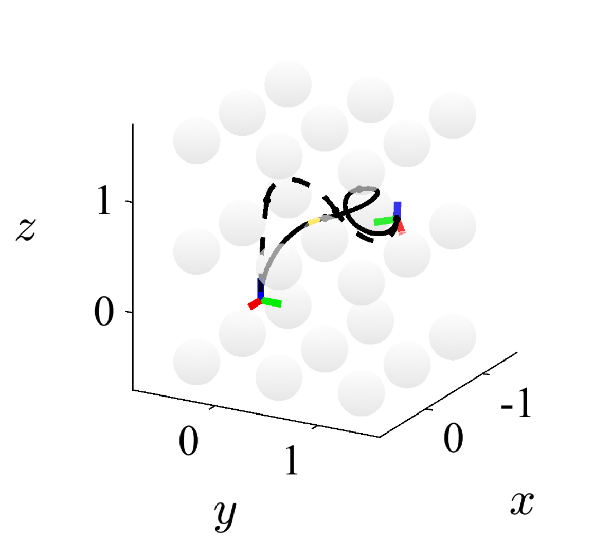
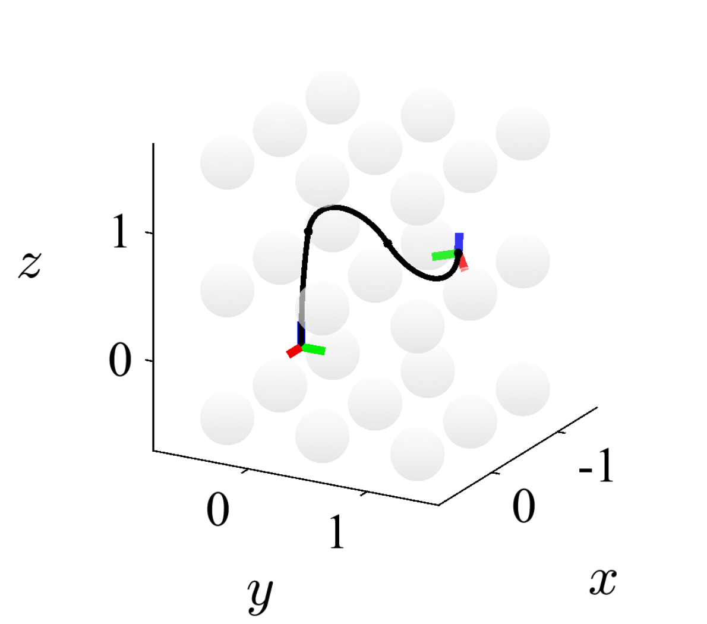
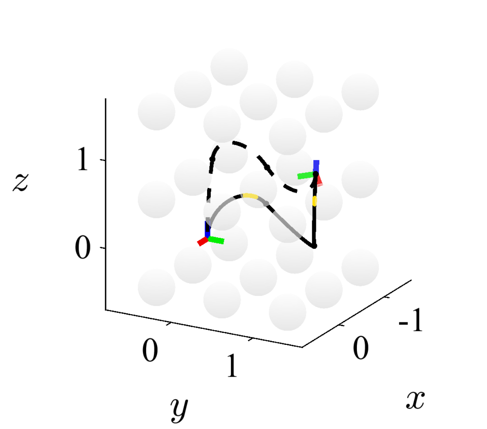
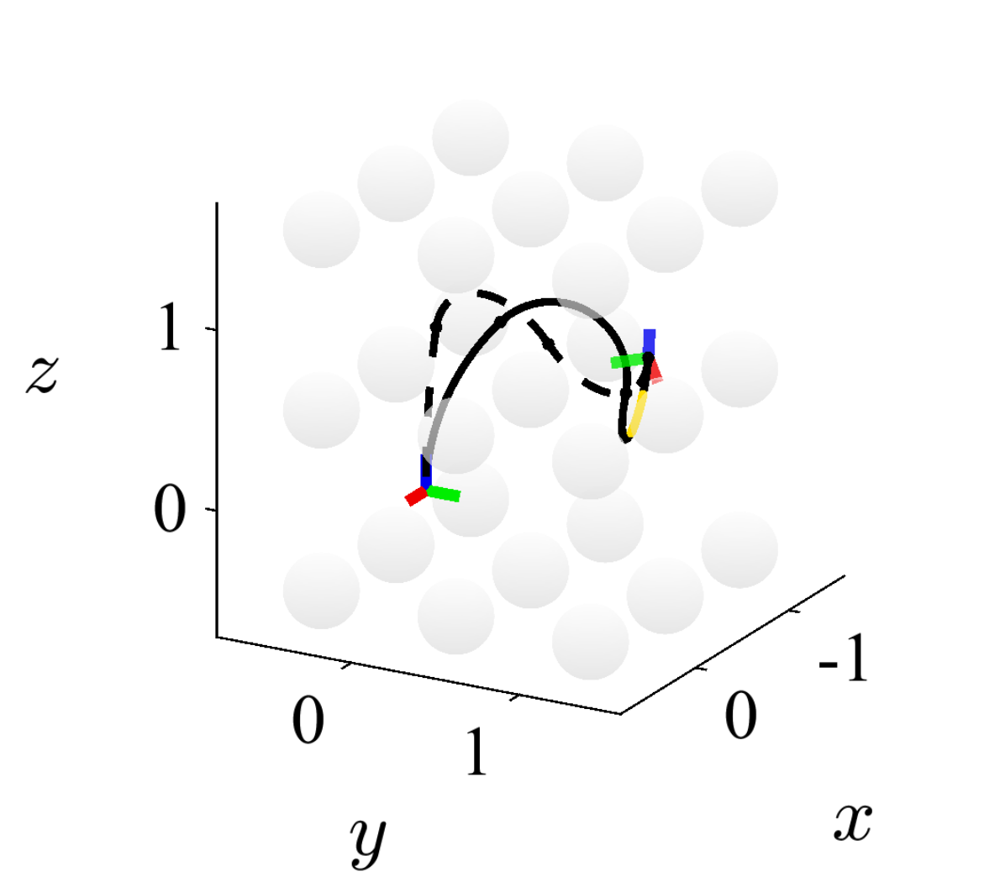
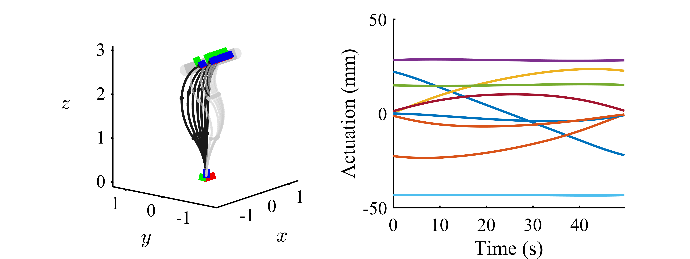
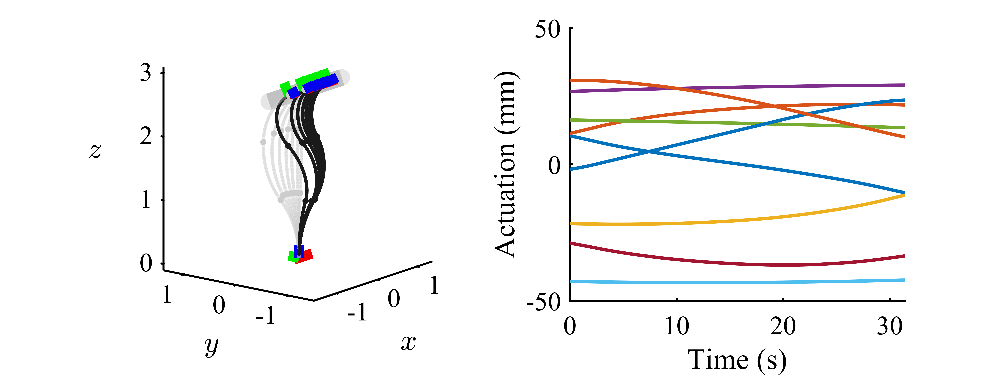

# An Actuator Space Optimal Path Tracking Framework for Continuum Robots: Theory, Algorithm and Validation

This repository implements the algorithms presented in our article.

Our previous work (titled: An Efficient Multi-solution Solver for the Inverse Kinematics of 3-Section Constant-Curvature Robots) appeared in proceedings of Robotics: Science and Systems 2023. If you enjoy this repository and use it, please cite our paper

```
@INPROCEEDINGS{Qiu-RSS-23, 
    AUTHOR    = {Ke Qiu AND Jingyu Zhang AND Danying Sun AND Rong Xiong AND Haojian LU AND Yue Wang}, 
    TITLE     = {An Efficient Multi-solution Solver for the Inverse Kinematics of 3-Section Constant-Curvature Robots}, 
    BOOKTITLE = {Proceedings of Robotics: Science and Systems}, 
    YEAR      = {2023}, 
    ADDRESS   = {Daegu, Republic of Korea}, 
    MONTH     = {July}, 
    DOI       = {10.15607/RSS.2023.XIX.091} 
} 
```

### Demo

**(main_demo.m)** Results of multiple solutions obtained by our algorithm.





**(main_demo2.m)** Results of tracking a straight line path in two different configurations obtained by our algorithm.





### Package Overview

**Demo (2 file)**

- main_demo.m  
- main_demo2.m  
<br/>

**Solver (7 files)**  
public:  
- micsolver.m  
- micsolverd.m

private:  
- rho.m  
- soln2xi.m  
- get_err.m  
- solve_r1.m  
- solve_r2.m  
<br/>

**Planner (3 files)**  
public:  
- dp.m  
- allocate_time.m

private:  
- PUTC.mat  
<br/>

**Numerical Methods (5 files)**  
public:  
- revise_grad.m  
- revise_dls.m  
- revise_newton.m

private:  
- revise_plot.m  
- jacobian3cc.m  
<br/>

**Quaternion Operations (3 files)**  
- up_plus.m  
- up_oplus.m  
- up_star.m  
<br/>

**Lie Algebra Operations (4 files)**  
- up_hat.m  
- up_vee.m  
- exphat.m  
- veelog.m  
<br/>

**Conversions (6 files)**  
- arc2q.m  
- q2arc.m  
- arc2xi.m  
- xi2arc.m  
- xi2len.m  
- q2rot.m  
- rot2q.m  
<br/>

**Other Tools (6 files)**  
- circles3.m  
- circles3c.m  
- frame.m  
- get_end.m  
- collision_indicator.m  
- collision_marker.m  
<br/>

### Functions

#### Solver

**micsolver.m**

`MICSOLVER` Multi-solution solver for the inverse kinematics of 3-section constant-curvature robots.

`[NOS, NOI] = MICSOLVER(L1, L2, L3, Q, R, TOL, IS_A_SOL)` returns the result of solving the 3-section inverse kinematics problem. The function uses preset resolutions or numerical methods to address the inverse kinematics problem. The function exits after one solution is found.

*Input parameters*  
`L1, L2, L3` section length  
`Q, R` desired end rotation and translation  
`TOL` error tolerance  
`IS_A_SOL` function handle  
It is used to judge if the given parameter is a solution to the inverse kinematics problem. The function has two inputs `(ERR, XI)` and one output in boolean type.

*Output parameters*  
`NOS` number of solutions  
`NOI` number of iterations in numerical correction

*Example*
```matlab
L1 = 1; L2 = 1; L3 = 1;
xi = arc2xi(L1, L2, L3, pi.*[1,2,1,2,1,2].*rand(1, 6));
T = get_end(L1, L2, L3, xi);
q = rot2q(T(1:3, 1:3));
r = T(1:3, 4);
tol = 1e-2; fun = @(e, x) e < tol;
tic;
[nos, ~] = micsolver(L1, L2, L3, q, r, tol, fun);
rt = toc*1000;
if nos
    fprintf('A solution is found in %.2f ms.\n', rt);
end
```

<br/>

**micsolverd.m**

`MICSOLVERD` Multi-solution solver (debug) for the inverse kinematics of 3-section constant-curvature robots.

`[SOL, NOS, NOI] = MICSOLVERD(L1, L2, L3, Q, R, PAR, NOC, TOL, MSTEP, IS_A_SOL, PLOT_EC, PLOT_IT)` returns the result of solving the 3-section inverse kinematics problem.

*Input parameters*  
`L1, L2, L3` section length  
`Q, R` desired end rotation and translation  
`PAR` length of the partition  
Scalar. The interval $[0, 1)$ is partitioned into subintervals with length `PAR`. A smaller `PAR` means finer resolution. We recommend `PAR = 0.03` for better efficiency and `PAR = 0.01` for more solutions.  
`NOC` number of corrections  
A 1-by-2 array. The model parameters $\hat{\boldsymbol{r}}_3$ and hat $\hat{\boldsymbol{r}}_1$ are corrected for `NOC(1)` and `NOC(2)` times after the approximation, respectively. Large `NOC` provides closer initial value and more computations. We recommend `NOC = [1, 2]` for better efficiency and `NOC = [5, 5]` for better estimation.  
`TOL` error tolerance  
`MSTEP` allowed maximum steps of iterations  
`IS_A_SOL` function handle  
This function is used to judge if the given parameter is a solution to the inverse kinematics problem. The function has two inputs `(ERR, XI)` and one output in boolean type.  
`PLOT_EC` set `'plot'` to visualise the traversal  
`PLOT_IT` set `'plot'` to visualise the numerical correction

*Output parameters*  
`SOL` solutions  
A 6-by-`NOS` array. Each column is the overall exponential coordinate `XI`.  
`NOS` number of solutions  
`NOI` number of iterations in numerical correction

*Example*
```matlab
L1 = 1; L2 = 1; L3 = 1;
alpha = 15*pi/16; omega = [0.48; sqrt(3)/10; -0.86];
q = [cos(alpha/2); sin(alpha/2)*omega];
r = [-0.4; 1.1; 0.8];
tol = 1e-2; fun = @(e, x) e < tol;
[sol, ~, ~] = micsolverd(L1, L2, L3, q, r, ...
                         0.01, [5, 5], tol, 10, fun, ...
                         'plot', 'plot');
for eta = 1: size(sol, 2)
    fh = figure();
    circles3(fh, L1, L2, L3, sol(:, eta), 'k-');
    view(119, 20);
end
```

<br/>

**rho.m**

`RHO` Computes the linear distance between two ends of a circular arc.

This is a private function of our solver.

<br/>

**soln2xi.m**

`SOLN2XI` Converts the output of our solver to an exponential coordinate.

This is a private function of our solver.

<br/>

**get_err.m**

`GET_ERR` Computes the error between desired and current end pose.

This is a private function of our solver.

<br/>

**solve_r1.m**

`SOLVE_R1` Computes the model parameter of the 1st section.

This is a private function of our solver.

<br/>

**solve_r2.m**

`SOLVE_R2` Computes the model parameter of the 2nd section using rotational and translational constraints.

This is a private function of our solver.

<br/>

#### Planner

**dp.m**

`DP` Finds the shortest path in a graph.

`[PATH, COST] = DP(XISC, LOSSFUN)` returns the paths and corresponding costs using the Dijkstra’s algorithm. The cell array `XISC` defines the vertices. The function handle `LOSSFUN` defines the weight of two adjacent edges. The output `PATH` and `COST` are cell arrays.

<br/>

**allocate_time.m**

`ALLOCATE_TIME` allocates optimal time to a given sequence of concatenated parameters, considering the actuator velocity constraints.

`TS = ALLOCATE_TIME(XIS)` returns the time array `TS`.

<br/>

**PUTC.mat**

This file stores the mechanism constants of our continuum robot prototype, like the radius of pullies, positions of channels. These data would be used when allocating time in the actuator space.

<br/>

#### Numerical Methods

**revise_*.m**

`REVISE_*` Correct the initial value with a numerical method.

`[XI_STAR, ERR, K] = REVISE_*(L1, L2, L3, Q, R, XI, MSTEP, TOL, TYPE)` returns the result of numerical correction.
   
*Methods*  
`grad` gradient method  
`dls` damped least square method  
`newton` Newton-Raphson method

*Input parameters*  
`L1, L2, L3` section length  
`Q, R` desired end rotation and translation  
`XI` initial value  
`MSTEP` allowed maximum steps of iterations  
`TOL` error tolerance  
`TYPE` set `'plot'` to visualise the numerical correction

*Output parameters*  
`XI_STAR` final value  
`ERR` final error  
`K` steps of iterations

*Example*  
```matlab
L1 = 1; L2 = 1; L3 = 1;
alpha = 15*pi/16; omega = [0.48; sqrt(3)/10; -0.86];
q = [cos(alpha/2); sin(alpha/2)*omega];
r = [-0.4; 1.1; 0.8];
xi_0 = arc2xi(L1, L2, L3, pi.*[1, 2, 1, 2, 1, 2].*rand(1, 6));
[xi, err, noi] = revise_grad(L1, L2, L3, q, r, xi_0, 2000, 1e-2, 'plot');
[xi, err, noi] = revise_dls(L1, L2, L3, q, r, xi_0, 2000, 1e-2, 'plot');
[xi, err, noi] = revise_newton(L1, L2, L3, q, r, xi_0, 200, 1e-2, 'plot');
```

<br/>

**revise_plot.m**

`REVISE_PLOT` Visualises the numerical correction.

This is a private function of numerical methods.

<br/>

**jacobian3cc.m**

`JACOBIAN3CC` Computes the Jacobian matrix when the forward kinematics is expressed by the product of exponentials formula.

`J = JACOBIAN3CC(L1, L2, L3, XI)` returns the 6-by-6 Jacobian matrix.

<br/>

#### Quaternion Operations

**up_plus.m**

`UP_PLUS` Computes the matrix for left multiplications of quaternions.

`Q_UP_PLUS = UP_PLUS(Q)` returns the left multiplication matrix of `Q`.

<br/>

**up_oplus.m**

`UP_OPLUS` Computes the matrix for right multiplications of quaternions.

`Q_UP_OPLUS = UP_OPLUS(Q)` returns the right multiplication matrix of `Q`.

<br/>

**up_star.m**

`UP_STAR` Computes the quaternion conjugation.

`Q_UP_STAR = UP_STAR(Q)` returns the conjugation of `Q`.

<br/>

#### Lie Algebra Operations

**up_hat.m**

`UP_HAT` Computes the Lie algebra of a vector.

`M = UP_HAT(V)` is an element of $\mathsf{so}_3$ or $\mathsf{se}_3$, where `V` is an element of $\mathbb{R}^3$ or $\mathbb{R}^6$, respectively.

<br/>

**up_vee.m**

`UP_VEE` Computes the vector of a Lie algebra.

`V = UP_VEE(M)` is an element of $\mathbb{R}^3$ or $\mathbb{R}^6$, where `M` is an element of $\mathsf{so}_3$ or $\mathsf{se}_3$, respectively.

<br/>

**exphat.m**

`EXPHAT` Composition of the hat map and the matrix exponential.

`M = EXPHAT(V)` is a matrix in $\mathsf{SO}_3$ or $\mathsf{SE}_3$ and is computed using Rodrigues' formula. The vector `V` is in $\mathbb{R}^3$ or $\mathbb{R}^4$. The hat map sends `V` to an element of $\mathsf{so}_3$ or $\mathsf{se}_3$.

<br/>

**veelog.m**

`VEELOG` Composition of the matrix logarithm and the vee map.

`V = VEELOG(M)` is a vector in $\mathbb{R}^3$ or $\mathbb{R}^4$ and is computed using Rodrigues' formula. The matrix `M` is in $\mathsf{SO}_3$ or $\mathsf{SE}_3$. The vee map sends an element of $\mathsf{so}_3$ or $\mathsf{se}_3$ to a vector.

<br/>

#### Conversions

**arc2q.m**

`ARC2Q` Converts arc parameters to a quaternion.

`Q = ARC2Q(KAPPA, PHI, L)` computes the quaternion `Q` representing the end rotation of a 1-section constant-curvature robot with curvature `KAPPA`, bending angle `PHI`, and section length `L`.

*Example*
```matlab
kappa = 2*pi/3;
phi = pi/3;
q = arc2q(kappa, phi, 1);
```

<br/>

**q2arc.m**

`Q2ARC` Converts a quaternion to arc parameters.

`ARC = Q2ARC(Q, L)` computes the arc parameters of a 1-section constant-curvature robot, including the curvature `KAPPA` and bending angle `PHI`. The section length is `L`. The quaternion `Q` represents the end rotation.

*Example*
```matlab
q = [1/2; -3/4; sqrt(3)/4; 0];
arc = q2arc(q, 1);
```

<br/>

**arc2xi.m**

`ARC2XI` Converts the arc parameters of 3 sections to the exponential coordinate.

`XI = ARC2XI(L1, L2, L3, ARC)` computes the exponential coordinate `XI` of a 3-section constant-curvature robot. The section lengths are `L1, L2` and `L3`, respectively. The parameter `ARC` is an array containing curvatures and bending angles of each section.

*Example*
```matlab
k1 = 4*sqrt(5)/5; p1 = atan(2);
k2 = sqrt(37)/5; p2 = -pi+atan(6);
k3 = sqrt(10)/5; p3 = -atan(3);
xi = arc2xi(1, 1, 1, [k1, p1, k2, p2, k3, p3]);
```

<br/>

**xi2arc.m**

`XI2ARC` Converts the exponential coordinate to the arc parameters of 3 sections.

`ARC = XI2ARC(L1, L2, L3, XI)` computes the arc parameter `ARC` of a 3-section constant-curvature robot. The section lengths are `L1, L2` and `L3`, respectively. The parameter `XI` is the overall exponential coordinate.

*Example*
```matlab
xi = [-1.6; 0.8; 1.2; -0.2; 0.6; 0.2];
arc = xi2arc(1, 1, 1, xi);
```

<br/>

**xi2len.m**

`XI2LEN` Converts the concatenated parameter to the actuator lengths.

`LEN = XI2LEN(XI)` computes the actuator lengths `LEN` of a 3-section constant-curvature robot. The concatenated parameter `XI` is defined in our article.

*Example*
```matlab
xi = [-1.6; 0.8; 1.2; -0.2; 0.6; 0.2];
len = xi2len(xi);
```

<br/>

**q2rot.m**

`Q2ROT` Converts a quaternion to a rotation matrix.

`R = Q2ROT(Q)` returns the rotation matrix that is equivalent to the quaternion.

<br/>

**rot2q.m**

`ROT2Q` Converts a rotation matrix to a quaternion.

`Q = ROT2Q(R)` returns the quaternion that is equivalent to the rotation matrix.

<br/>

#### Other Tools

**circles3.m**

`CIRCLES3` Visualises the 3-section constant-curvature robot with given model parameters.

`CIRCLES3(FH, L1, L2, L3, XI, TYPE)` displays the plot in target figure `FH`. The robot is described by the section lengths `L1, L2, L3` and the overall exponential coordinate `XI`. Line colours and styles are specified in the character string `TYPE`.

*Example*
```matlab
L1 = 1; L2 = 1; L3 = 1;
xi_1 = [-1.60; 0.08; 1.20; -0.20; 0.60; 0.20];
circles3(1, L1, L2, L3, xi_1, 'k--');
xi_2 = [-0.39; 0.48; -1.13; 0.47; 1.79; -0.17];
circles3(1, L1, L2, L3, xi_2, 'k-');
view(75, 9);
```

<br/>

**circles3c.m**

`CIRCLES3` Visualises the 3-section constant-curvature robot with given model parameters and a specified colour.

`CIRCLES3C(FH, L1, L2, L3, XI, TYPE, COLOUR)` displays the plot in target figure `FH`. The robot is described by the section lengths `L1, L2, L3` and the overall exponential coordinate `XI`. Line styles are specified in the character string `TYPE`, line colours are specified in the triple `COLOUR`.

*Example*
```matlab
L1 = 1; L2 = 1; L3 = 1;
xi_1 = [-1.60; 0.08; 1.20; -0.20; 0.60; 0.20];
circles3c(1, L1, L2, L3, xi_1, '--', [0.1, 0.1, 0.1]);
xi_2 = [-0.39; 0.48; -1.13; 0.47; 1.79; -0.17];
circles3c(1, L1, L2, L3, xi_2, '-', [0.2, 0.2, 0.2]);
view(75, 9);
```

<br/>

**frame.m**

`FRAME` draws a coordinate frame with specified position (and orientation) and transparency.

`FRAME(FH, A, ALPHA)` displays the plot in target figure `FH`. The position (and orientation) is specified by `A` and the transparency is specified by `ALPHA`.

*Example*
```matlab
frame(1, [eye(3), zeros(3, 1); 0, 0, 0, 1], 0.3);
```

<br/>

**get_end.m**

`GET_END` Computes the end pose of a 3-section constant-curvature robot.

`T = GET_END(L1, L2, L3, XI)` returns the 4-by-4 matrix of end pose.

*Example*
```matlab
xi = [-1.6; 0.8; 1.2; -0.2; 0.6; 0.2];
T = get_end(1, 1, 1, xi);
```

<br/>

**collision_indicator.m**

`COLLISION_INDICATOR` Computes the minimal distance between the sample points and the spherical obstacles.

`COLLIDE = COLLISION_INDICATOR(L1, L2, L3, XI, RO, ROR, SMP)` returns the minimal distance `COLLIDE`. If `COLLIDE > 0`, then no collision occurs. If `COLLIDE < 0`, then the robot collides with obstacles. The robot is described by the section lengths `L1, L2, L3` and the overall exponential coordinate `XI`. The obstacles are spheres centring at `RO` with radius `ROR`. The sample points are distributed uniformly along the robot curve with the number `SMP`.

*Example*
```matlab
L1 = 1; L2 = 1; L3 = 1;
xi = [-1.6; 0.8; 1.2; -0.2; 0.6; 0.2];
ro = [0.8; 0.7; 0.6];
ror = 0.4;
collide = collision_indicator(L1, L2, L3, xi, ro, ror, 10);
```

<br/>

**collision_marker.m**

`COLLISION_MARKER` Visualises the collision part in yellow.

`COLLISION_MARKER(L1, L2, L3, XI, RO, ROR)` draws the part of the robot that is collided with obstacles. The robot is described by the section lengths `L1, L2, L3` and the overall exponential coordinate `XI`. The obstacles are spheres centring at `RO` with radius `ROR`.

*Example*
```matlab
L1 = 1; L2 = 1; L3 = 1;
xi = [-1.6; 0.8; 1.2; -0.2; 0.6; 0.2];
ro = [0.8; 0.7; 0.6];
ror = 0.4;
circles3(1, L1, L2, L3, xi, 'k-');
collision_marker(L1, L2, L3, xi, ro, ror);
view(75, 9);
```

<br/>

